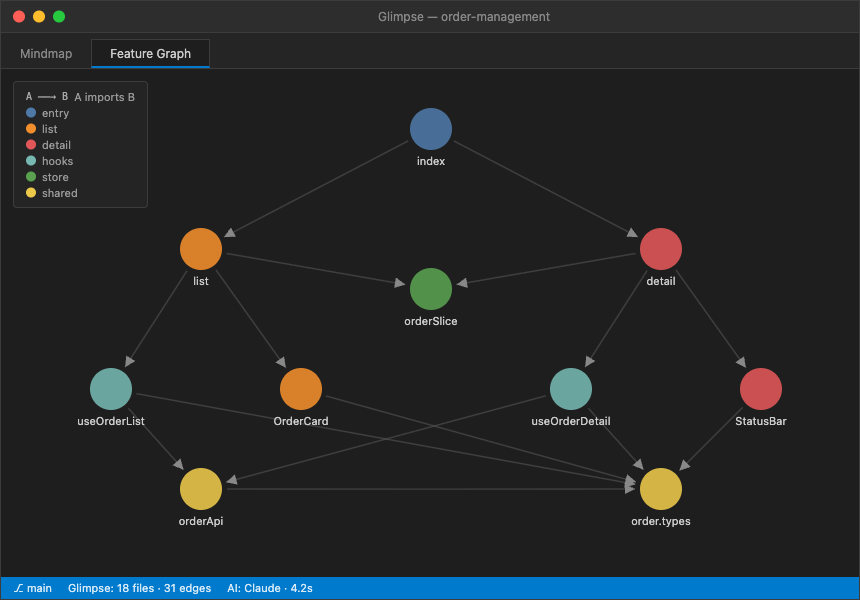

# Glimpse

> **Right-click any module folder → instant AI-powered architecture map in your editor.**

Glimpse is a VS Code extension that analyzes a feature folder in your codebase, calls a local AI CLI (Claude or Codex), and renders two interactive views side by side:

- **Mindmap** — four-dimensional breakdown: responsibilities, public exports, external dependencies, data flow
- **Feature Graph** — file-level dependency graph with per-file AI annotations, hover tooltips, and click-to-navigate

Built for large React / Vue 2 + TypeScript monorepos, with first-class support for Webpack Module Federation.

---

## Demo



*Feature Graph of an `order-management` module — nodes are source files, arrows show import direction (A → B means A imports B), colors group files by feature domain. Hover any node for AI-generated usage summary, state variables, and interaction flows. Click to jump to the file (or directly to a method).*

---

## Features

| | |
|---|---|
| **Static analysis** | Parses `.ts` `.tsx` `.vue` `.js` with [ts-morph](https://ts-morph.com/) and vue-template-compiler — no runtime required |
| **AI annotations** | Calls your local `claude` or `codex` CLI; zero API key setup, uses your own subscription |
| **Mindmap view** | Markmap-rendered four-axis tree: responsibility · exports · deps · data flow |
| **Feature Graph** | D3 force-DAG hybrid layout, file-level nodes, directed edges, interactive popovers |
| **Directory folding** | Modules with >15 files auto-fold subdirectories into collapsible folder nodes |
| **Click to navigate** | Node click opens the file; if AI found method names, jumps straight to the declaration |
| **Module Federation** | Detects `exposes` / `remotes` in `webpack.config.js` and surfaces cross-app deps |
| **Zero secrets** | Skeleton summary only (export/import lists) is sent to the AI — no full source code |

---

## Requirements

- **VS Code** 1.85+
- **Node.js** 18+
- One of:
  - [`claude`](https://claude.ai/code) CLI (Claude Code) — `which claude` must succeed
  - [`codex`](https://github.com/openai/codex) CLI — `which codex` must succeed
- The target codebase should contain `.ts`, `.tsx`, `.vue`, or `.js` files

---

## Installation

```bash
# Clone and build locally
git clone https://github.com/your-org/glimpse
cd glimpse
pnpm install
pnpm run compile
```

Then press **F5** in VS Code to open an Extension Development Host, or package with `vsce package` and install the `.vsix`.

---

## Usage

1. Open the codebase you want to explore in VS Code
2. In the Explorer sidebar, **right-click any feature folder** (or a single `.ts` / `.tsx` / `.vue` file)
3. Choose **"Glimpse: Analyze This Module"**
4. A panel opens beside your editor — watch the progress steps as static analysis and AI annotation run
5. Switch between **Mindmap** and **Feature Graph** tabs

### Feature Graph interactions

| Action | Result |
|--------|--------|
| Hover a node | Popover with AI summary, state variables, interaction flows, methods |
| Click a node | Opens the file; jumps to the first exported method if available |
| Hover an edge | Shows full relative paths of both files |
| Scroll / drag | Pan and zoom the graph |
| Click a folder node `▶` | Expands the directory inline |
| Click again `▼` | Collapses back |
| Toolbar `⊡` | Fit graph to screen |
| Toolbar `SVG` / `PNG` | Export the mindmap |

---

## Configuration

| Setting | Default | Description |
|---------|---------|-------------|
| `glimpse.aiProvider` | `"auto"` | `auto` \| `claude` \| `codex` — which CLI to use |
| `glimpse.companyScopes` | `["@scfe", "@ssc", …]` | Package prefixes treated as internal company deps (shown separately in the mindmap) |

---

## How it works

```
Right-click folder
      ↓
Static analyzer (ts-morph + vue-template-compiler)
      → FileInfo[] : exports, imports, MF deps
      ↓
Prompt builder  →  compact skeleton (~1500 tokens, no source code)
      ↓
claude --print / codex  →  AIOutput JSON
      ↓
Merge: ModuleAnalysis = skeleton + AI annotations
      ↓
Webview postMessage
      ├── Mindmap  (markmap Markdown)
      └── Feature Graph  (D3 force-DAG, file nodes)
```

**Key design decisions:**

- **File-level graph nodes** — each node is one source file, so click-to-navigate is always exact
- **Hybrid force-DAG layout** — topological sort assigns vertical layer (depth), D3 force handles horizontal spread; cycles fall back gracefully
- **Subprocess AI calls** — no API key stored in VS Code; the extension shells out to the CLI the user already authenticated
- **Skeleton-only prompts** — only export names, import paths, and file structure are sent; full source stays local

---

## Project structure

```
src/
├── extension.ts          # Activation, command registration
├── commands/
│   └── analyzeModule.ts  # Entry: drives static analysis → AI → webview
├── analyzer/
│   ├── index.ts          # Orchestrator (walks files, routes to analyzers)
│   ├── react-analyzer.ts # ts-morph parser for .ts/.tsx
│   ├── vue-analyzer.ts   # vue-template-compiler parser for .vue
│   └── mf-analyzer.ts    # Webpack Module Federation config reader
├── ai/
│   ├── prompt-builder.ts # Skeleton → prompt string
│   ├── claude-skill.ts   # claude --print subprocess wrapper
│   ├── codex-skill.ts    # codex subprocess wrapper
│   └── detector.ts       # Auto-detects available CLI
└── webview/
    ├── provider.ts        # WebviewPanel manager + full UI HTML/JS
    ├── messages.ts        # Typed Extension ↔ Webview message contracts
    └── ui/
        ├── mindmap.ts     # ModuleAnalysis → markmap Markdown
        └── feature-graph.ts  # ModuleAnalysis → FeatureGraphData (nodes + edges)
```

---

## License

MIT
